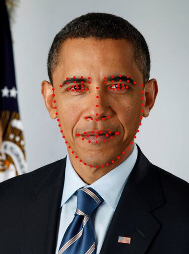

# face-parser

## 1. Face Segmentation

### 1.1. BiSeNet


```python
from visage.bisenet import BiSeNetFaceParser
from visage.visualize import apply_colormap

img = load_img()  # torch.Tensor [3, H, W] in range [-1, 1]

face_parser = BiSeNetFaceParser()
segmentation_mask = face_parser.parse(img)

# Plotting
segmentation_mask_colored = apply_colormap(segmentation_mask)  # Colorizes each class with a distinct color for better viewing
plt.imshow(segmentation_mask_colored)

```

## 2. Face Bounding Boxes

### 2.1. FaceBoxesV2


```python
from visage.bounding_boxes.face_boxes_v2 import FaceBoxesV2

img = load_img()  # np.ndarray [H, W, 3] in range [0, 255]

detector = FaceBoxesV2()
detected_bboxes = detector.detect(img)

# Plotting
cv2.rectangle(img, detected_bboxes[0].get_point1(), detected_bboxes[0].get_point2(), (255, 0, 0), 10)
plt.imshow(img)
```

## 3. Facial Landmarks

### 3.1. PIPNet



```python
from visage.landmark_detection.pipnet import PIPNet

img = load_img()  # np.ndarray [H, W, 3] in range [0, 255]
detected_bboxes = ...  # <- from step 2.

pip_net = PIPNet()
landmarks = pip_net.forward(img, detected_bboxes[0])

# Plotting
for x, y in landmarks:
    cv2.circle(img, (int(x), int(y)), 5, (255, 0, 0), -1)

plt.imshow(img)
```